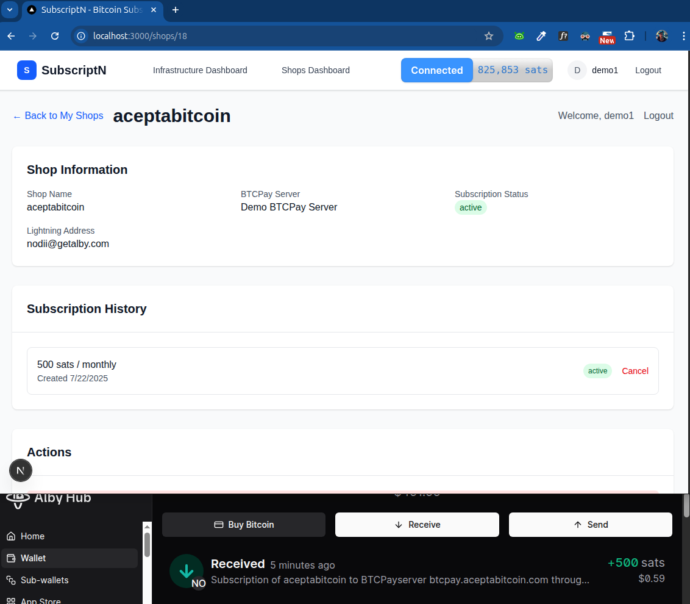

<!-- Project Logo/Banner -->
<p align="center">
  
</p>

# SubscriptN

_Bitcoin subscriptions made easy. Lightning fast. ⚡_


## �� Table of Contents

- [🎯 Overview](#-overview)
- [✨ Features](#-features)
- [📸 Screenshots](#-screenshots)
- [🚀 Quick Start](#-quick-start)
- [📦 Installation](#-installation)
- [🔧 Configuration](#-configuration)
- [💡 Usage](#-usage)
- [🔒 Security & Privacy](#-security--privacy)
- [🤝 Contributing](#-contributing)
- [📚 Development Log](#-development-log)
- [❓ FAQ](#-faq)

## 🎯 Overview

**SubscriptN** is a Bitcoin subscription management platform that enables automated Lightning payments for recurring services. Built with Next.js 15, TypeScript, and SQLite, it provides a seamless interface for both BTCPay Server providers and shop owners to manage subscriptions through the Lightning network.

### How It Works

1. **BTCPay Server Providers** list their infrastructure with available slots
2. **Shop Owners** browse public servers and connect their shops
3. **Lightning Payments** are automatically processed through connected wallets
4. **Subscription Management** handles recurring payments and payment history

## ✨ Features

- **Lightning Payments**: Direct WebLN integration for real Bitcoin payments
- **BTCPay Server Marketplace**: Browse and connect to public servers with available slots
- **Shop Management**: Create shops with automated subscription payments
- **Wallet Integration**: Bitcoin Connect for seamless wallet management
- **Public/Private Options**: Control visibility for servers and shops
- **Real-time Status**: Live payment tracking and connection monitoring

## 📸 Screenshots

### Home Dashboard
*BTCPay Server owners and shop owners can both have their dashboard and find each other*

<div align="center">
  
</div>

### Lightning Payment Flow
*Development progress from Geyser Hackathon to working implementation - working subscription from shop owner to BTCPay Server admin, enabled by NWC protocol*

<div align="center">
  
</div>

## 🚀 Quick Start

### Prerequisites
- Node.js 18+ 
- npm or yarn
- Lightning wallet (NWC | WebLN compatible)

### Lightning Wallet Requirements

#### WebLN Compatible Wallets
- **Alby** - [getalby.com](https://getalby.com)
- **BlueWallet** - [bluewallet.io](https://bluewallet.io)
- **Zap** - [zaphq.io](https://zaphq.io)

#### NWC (Nostr Wallet Connect) Compatible Wallets
- **Alby Hub** - [hub.getalby.com](https://hub.getalby.com)
- **Coinos** - [coinos.io](https://coinos.io)
- **Mutiny Wallet** - [mutinywallet.com](https://mutinywallet.com)
- **Zeus** - [zeusln.app](https://zeusln.app)

## 📦 Installation

```bash
# Clone the repository
git clone https://github.com/NodeDiver/subscriptn-simple.git
cd subscriptn-simple

# Install dependencies
npm install

# Set up environment variables
cp env.example .env.local
# Edit .env.local with your configuration

# Start development server
npm run dev
```

## 🔧 Configuration

### Environment Variables

Create a `.env.local` file with the following variables:

```env
# Database
DATABASE_URL=./subscriptn.db

# Session Secret (generate a random string)
SESSION_SECRET=your-session-secret-here

# Bitcoin Connect Configuration
BITCOIN_CONNECT_APP_NAME=SubscriptN
BITCOIN_CONNECT_APP_DESCRIPTION=Bitcoin subscription management platform
```

### Database Setup

The application uses SQLite and will automatically create the database on first run. No additional setup required.

## 💡 Usage

### For BTCPay Server Providers

1. **Register/Login**: Create an account or log in
2. **Add Your Server**: Navigate to Infrastructure → Add Server
3. **Configure Server**: Set public/private status, available slots, and lightning address
4. **List Publicly**: Your server appears in the public browsing section
5. **Manage Subscriptions**: Monitor connected shops and payment history

### For Shop Owners

1. **Register/Login**: Create an account or log in
2. **Browse Servers**: View available BTCPay servers in the Infrastructure section
3. **Connect Wallet**: Use the Connect Wallet button to link your Lightning wallet
4. **Create Shop**: Add your shop to a chosen server
5. **Set Up Subscription**: Configure recurring payments with Lightning
6. **Monitor Payments**: Track payment history and subscription status

## 🔒 Security & Privacy

For comprehensive security information, please see [SECURITY.md](SECURITY.md).

**Security measures will be implemented in the future.**

## 🤝 Contributing

We welcome contributions! Contact: nodediver@proton.me

1. Fork the repository
2. Create a feature branch  
3. Make your changes
4. Submit a pull request

## 📚 Development Log

### Current Status: Week 4 - Shop Creation Enhancement & UI/UX Improvements

**Latest Session: 2025-01-27**
- ✅ **Server-Specific Shop Fetching**: New API endpoint for fetching shops from selected BTCPay servers
- ✅ **Subscription Validation**: Prevents duplicate subscriptions to shops with active subscriptions
- ✅ **Enhanced Shop Selection**: Greys out subscribed shops, shows availability status
- ✅ **No Shops Handling**: Warning messages when BTCPay servers have no shops
- ✅ **Homepage Layout Optimization**: Reduced spacing to show "Browse Servers" and "Browse Shops" buttons in first view
- ✅ **Shops Dashboard Improvements**: Removed lapsed subscriptions counter, renamed "Browse Public Shops" to "Shop listing"
- ✅ **Homepage Navigation Updates**: Changed dashboard link to /dashboard, removed "Browse Shops" button for logged-in users
- ✅ **Footer Optimization**: Made footer more compact while maintaining all functionality
- ✅ **README Streamlining**: Condensed features and contributing sections for better readability

**Week 4 Achievements:**
- **Infrastructure System**: Complete transformation with public server listings
- **Database Migration**: Enhanced server schema with public/private functionality
- **User Experience**: Streamlined navigation and consolidated dashboard views
- **UI/UX Optimization**: Improved homepage layout and component spacing
- **Shop Creation System**: Advanced shop selection with subscription validation
- **Technical Debt**: Resolved API route issues and improved code quality

**Current Focus:**
- User experience improvements
- Code quality enhancements
- Performance optimization

<details>
<summary><strong>Week 4: 2025-01-27</strong></summary>

### 2025-01-27: Infrastructure Dashboard Consolidation
- **My Servers Page Removal**: Deleted separate My Servers page and consolidated functionality
- **Browse Servers Preservation**: Maintained public server browsing as primary function
- **Enhanced Dashboard**: Combined public browsing and user management in single view
- **Navigation Updates**: Simplified UserDropdown with single "Browse Servers" link
- **User Experience**: Contextual sections for different user states

### 2025-01-27: Database Migration & Public Server Listing
- **Schema Enhancement**: Added description, is_public, slots_available, lightning_address columns
- **Public Server API**: Created dedicated endpoint for public server listings
- **Infrastructure Transformation**: Converted dashboard to public server browsing
- **Slot Calculation**: Implemented available slots calculation with shop counting
- **Navigation Restructure**: Updated UserDropdown and homepage links

### 2025-01-27: Enhanced BTCPay Server Registration
- **Form Enhancement**: Added description, public listing, slots, and lightning address fields
- **Validation**: Comprehensive validation for all new fields
- **User Experience**: Improved field descriptions and default values
- **Database Migration**: Safe migration for existing servers

### 2025-01-27: Settings Page & Wallet Integration
- **Wallet Section**: Added comprehensive wallet section to settings page
- **Bitcoin Connect**: Integrated Bitcoin Connect button with placeholder features
- **UI Enhancement**: Professional wallet interface with balance and payment history
- **Future Ready**: Foundation for advanced wallet functionality

</details>

<details>
<summary><strong>Week 3: 2025-07-15 to 2025-07-21</strong></summary>

### 2025-07-15: Enhanced BTCPay Server Registration & Settings Page
- **Server Form Enhancement**: Added description, public listing, slots, and lightning address fields
- **Settings Page Fix**: Resolved userServers.map and userShops.map errors
- **Wallet Integration**: Added Bitcoin Connect button to settings page
- **Database Migration**: Enhanced server schema with new required fields

### 2025-07-15: Dashboard UI Improvements
- **View Details Removal**: Removed ugly "View Details" buttons from BTCPay server items
- **Clickable Content**: Made server titles and descriptions clickable for navigation
- **User Experience**: Improved visual design and interaction patterns

### 2025-07-15: Settings Page Error Fix
- **API Data Extraction**: Fixed nested data extraction from API responses
- **Error Resolution**: Resolved userServers.map and userShops.map function errors
- **Safety Checks**: Added proper fallbacks and null checks

### 2025-07-15: Wallet Section Addition
- **New Section**: Added comprehensive wallet section to settings page
- **Bitcoin Connect**: Integrated existing ConnectWalletButton component
- **Placeholder Features**: Added balance display and payment history placeholders
- **Future Foundation**: Ready for advanced wallet functionality

</details>

<details>
<summary><strong>Week 2: 2025-07-08 to 2025-07-14</strong></summary>

### 2025-07-12: Bitcoin Connect API Integration
- **Official API**: Replaced custom implementation with official @getalby/bitcoin-connect API
- **State Management**: Improved wallet connection state synchronization
- **Error Handling**: Enhanced error handling and connection management
- **Component Integration**: Better integration between TopBar and LightningSubscription

### 2025-07-12: UI/UX Improvements
- **Text Color Fixes**: Resolved unreadable white text in dashboard pages
- **Duplicate Prevention**: Implemented BTCPay server and shop duplicate prevention
- **Server Management**: Added server removal functionality with proper cleanup
- **User Experience**: Enhanced navigation and visual feedback

### 2025-07-12: Security & Validation
- **Input Validation**: Comprehensive validation for all user inputs
- **Rate Limiting**: Added rate limiting to critical endpoints
- **Duplicate Prevention**: Server and shop ownership validation
- **Error Handling**: Improved error messages and user feedback

### 2025-07-08: User Registration & Dropdown Menu
- **Registration System**: Complete user registration with validation and security
- **Beautiful Dropdown**: Professional dropdown menu with user profile and navigation
- **Navigation Cleanup**: Moved infrastructure and shop links to dropdown
- **User Experience**: Enhanced authentication flow and navigation

### 2025-07-08: Theme System Enhancement
- **Three-option System**: Added system, light, and dark theme options
- **System Detection**: Automatic system preference detection
- **Dropdown Integration**: Moved theme switcher to dropdown menu
- **Visual Polish**: Enhanced animations and hover effects

### 2025-07-08: Bitcoin Connect Integration
- **Wallet Connection**: Moved Bitcoin Connect button to dropdown menu
- **State Management**: Proper wallet connection state management
- **UI Integration**: Seamless integration with existing dropdown design
- **User Experience**: Improved wallet connection accessibility

</details>

<details>
<summary><strong>Week 1: 2025-07-01 to 2025-07-07</strong></summary>

### 2025-07-05: Project Kickoff & Local Setup
- **Project Initialization**: Set up Next.js 15 with TypeScript and Tailwind CSS
- **Database Design**: Created SQLite schema with users, servers, shops, and subscriptions
- **Authentication**: Implemented session-based authentication system
- **Basic UI**: Created infrastructure and shops dashboards

### 2025-07-05: Development Infrastructure
- **Development Log**: Created comprehensive development tracking system
- **Git Repository**: Set up GitHub repository with proper documentation
- **Local Development**: Configured development environment and dependencies
- **Project Structure**: Established organized file structure and conventions

### 2025-07-05: UI Components & Navigation
- **Top Bar**: Created persistent top bar menu across all pages
- **Sidebar**: Implemented sliding sidebar with smooth animations
- **Navigation**: Role-based navigation for providers and shop owners
- **Responsive Design**: Mobile-friendly interface with proper breakpoints

### 2025-07-05: Bitcoin Connect Integration
- **Phase 1**: Added "Connect Wallet" button to TopBar with state management
- **Phase 2**: Implemented real Bitcoin Connect modal with WebLN integration
- **Wallet Support**: Multiple wallet provider support (Alby, BlueWallet, etc.)
- **Connection Management**: Proper connection state management and error handling

### 2025-07-05: Lightning Integration
- **Lightning Service**: Created Lightning service for invoice generation and payments
- **WebLN Integration**: Real Lightning payments through connected wallets
- **Payment History**: Complete payment tracking with Lightning details
- **Database Schema**: Enhanced database for Lightning payment data

</details>

## ❓ FAQ

**What is SubscriptN and what does it do?**
SubscriptN is a Bitcoin subscription management platform that enables automated Lightning payments for recurring services. It connects BTCPay Server providers with shop owners, facilitating seamless subscription management through the Lightning network.

**Do I need a BTCPay Server to use this?**
No, you don't need your own BTCPay Server. You can browse and connect to public BTCPay servers listed on the platform. However, if you want to provide infrastructure, you'll need to set up a BTCPay Server.

**What Lightning wallets are supported?**
We support both WebLN and NWC (Nostr Wallet Connect) compatible wallets. See the [Lightning Wallet Requirements](#lightning-wallet-requirements) section for a complete list of supported wallets.

**How does the subscription payment process work?**
1. Shop owners browse available BTCPay servers
2. They connect their Lightning wallet using Bitcoin Connect
3. They create a shop and set up a subscription with recurring payments
4. Lightning payments are automatically processed through their connected wallet
5. Payment history and subscription status are tracked in real-time

**Is this production-ready for businesses?**
This is currently a development project with working Lightning payments. While the core functionality is implemented, it's recommended for testing and development purposes. See [SECURITY.md](SECURITY.md) for detailed security information.
