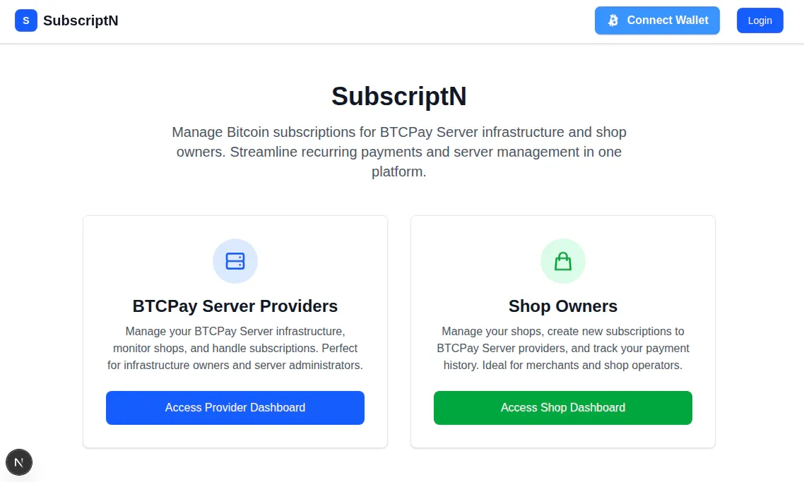

<!-- Project Logo/Banner -->
<p align="center">
  
</p>

# SubscriptN

_Bitcoin subscriptions made easy. Lightning fast. ⚡_


## 📋 Table of Contents
- [Overview](#overview)
- [Features](#features)
- [Screenshots](#screenshots)
- [Quick Start](#quick-start)
- [Installation](#installation)
- [Lightning Wallet Requirements](#lightning-wallet-requirements)
- [Security & Privacy](#security--privacy)
- [FAQ](#faq)
- [Development Log](#development-log)
- [Contributing](#contributing)

## 🎯 Overview

SubscriptN is a Bitcoin subscription management platform that enables shop owners to create and manage recurring lightning network payments. It bridges BTCPay Server infrastructure with Lightning wallets to automate subscription billing using real Bitcoin payments.

### How It Works
1. **Connect Wallet** - Shop owners connect their Lightning wallet
2. **Select Store** - Choose a BTCPay Server store and set subscription details
3. **Create Invoice** - System generates Lightning invoices automatically
4. **Process Payment** - Wallet pays the invoice instantly
5. **Manage Subscriptions** - Track and manage all recurring payments

## ⚡ Features

- ⚡ **Real lightning network payments** using @getalby/lightning-tools
- 🏪 **Unified dashboard** access for all users (no complex roles)
- 🔒 **Secure authentication** & privacy-first design
- 🔗 **Bitcoin Connect integration** with WebLN support
- 🎨 **Modern, responsive UI** (dark mode ready!)
- 💳 **Direct Lightning address integration** for invoice generation
- 📊 **Payment history tracking** with detailed transaction info
- 🔄 **Automated subscription management** with recurring payments

## 📸 Screenshots

<div align="center">
  
  
</div>

<div align="center">
  
  <p><em>BTCPay Server owners and shop owners can both access their dashboard and find each other</em></p>
</div>

<div align="center">
  
  <p><em>Working subscription flow: shop owner to BTCPay Server admin with NWC protocol support</em></p>
</div>

## 🚀 Quick Start

```bash
# Clone and set up SubscriptN
git clone https://github.com/yourusername/subscriptn-simple.git
cd subscriptn-simple
npm install
cp env.example .env.local
# Edit .env.local with your BTCPay Server details
npm run dev
```

> 💡 **Pro Tip:** Connect your Lightning wallet in just two clicks!
>
> 🏆 **Hackathon Winner:** Built during Geyser Hackathon 2025!

## 📦 Installation

### Prerequisites
- **Node.js 18+** 
- **npm or yarn**
- **BTCPay Server instance**
- **BTCPay Server API key**

### Step-by-Step Setup

1. **Clone the repository**
   ```bash
   git clone https://github.com/yourusername/subscriptn-simple.git
   cd subscriptn-simple
   ```

2. **Install dependencies**
   ```bash
   npm install
   ```

3. **Configure environment variables**
   ```bash
   cp env.example .env.local
   ```
   
   Edit `.env.local` with your BTCPay Server details:
   ```env
   BTCPAY_HOST=https://your-btcpay-server.com
   BTCPAY_API_KEY=your-btcpay-api-key
   ```

4. **Start the development server**
   ```bash
   npm run dev
   ```
   
   The app will be available at `http://localhost:3000`

### Demo Access
- **Username:** `demo`
- **Password:** `demo`

## ⚡ Lightning Wallet Requirements

To use the subscription payment features, you'll need a Lightning wallet with WebLN or NWC support:

### WebLN Compatible Wallets
- **Alby** (recommended) - [getalby.com](https://getalby.com)
- **BlueWallet** - [bluewallet.io](https://bluewallet.io)
- **Phoenix** - [phoenix.acinq.co](https://phoenix.acinq.co)
- **Breez** - [breez.technology](https://breez.technology)

### NWC (Nostr Wallet Connect) Compatible Wallets
- **Alby Hub** - [hub.getalby.com](https://hub.getalby.com)
- **Coinos** - [coinos.io](https://coinos.io)
- **Mutiny Wallet** - [mutinywallet.com](https://mutinywallet.com)
- **Zeus** - [zeusln.app](https://zeusln.app)

## 🔒 Security & Privacy

For security concerns, deployment recommendations, and best practices, please see [SECURITY.md](SECURITY.md).

This includes:
- 🚨 How to report security vulnerabilities
- 🔒 Essential security steps for deployment
- 📋 Environment variable configuration
- 🗄️ Database security guidelines
- 🛡️ Development security recommendations

## ❓ FAQ

### **Q: What is SubscriptN and what does it do?**
**A:** SubscriptN is a Bitcoin subscription management platform that allows shop owners to create and manage recurring lightning network payments. It connects BTCPay Server infrastructure with Lightning wallets to automate subscription billing using real Bitcoin payments.

### **Q: Do I need a BTCPay Server to use this?**
**A:** Yes, you need a BTCPay Server instance and an API key. The application acts as a bridge between your BTCPay Server (which handles the payment processing) and Lightning wallets (which make the payments). You can set up your own BTCPay Server or use a hosted service.

### **Q: What Lightning wallets are supported?**
**A:** SubscriptN supports both WebLN and NWC (Nostr Wallet Connect) compatible wallets. Popular options include Alby, BlueWallet, Phoenix, Breez, Alby Hub, Coinos, Mutiny Wallet, and Zeus. See the [Lightning Wallet Requirements](#lightning-wallet-requirements) section for the complete list.

### **Q: How does the subscription payment process work?**
**A:** 1) Shop owners connect their Lightning wallet, 2) They select a BTCPay Server store and set subscription details (amount, frequency), 3) The system creates a Lightning invoice, 4) The wallet pays the invoice, 5) The subscription is activated and will automatically create new invoices for recurring payments.

### **Q: Is this production-ready for businesses?**
**A:** This is a beginner project built during a hackathon. While it demonstrates the core functionality, it uses demo credentials and basic security. For production use, you should implement proper user registration, password hashing, and additional security measures as outlined in [SECURITY.md](SECURITY.md).

## 📚 Development Log

### Current Status (Week 4)
- 🎨 *Completed comprehensive Light/Dark Mode Toggle implementation across entire application*
- 👤 *Added complete user registration system with signup page and API*
- 🎯 *Implemented beautiful user dropdown menu with smooth animations*
- 🐛 *Started Week 4 by addressing Next.js API route errors and technical debt*
- 🔧 *Planning to fix params.shopId async/await issues in dynamic routes*

### Recent Achievements
- 🎯 *Created beautiful UserDropdown component with smooth animations and dark mode support*
- 👤 *Implemented comprehensive user registration system with signup page and API*
- 🌙 *Implemented simplified theme architecture with direct HTML class manipulation*
- 🎨 *Added comprehensive dark mode support to all pages and components*
- 🔧 *Fixed critical UI/UX issues and implemented comprehensive duplicate prevention*
- 🛡️ *Added robust database constraints and ownership management*
- ⚡ *Enhanced Bitcoin Connect integration with official API*
- 🧹 *Performed major database cleanup and system optimization*

<details>
<summary>📖 Detailed Development History</summary>

<details>
<summary>Week 4: 2025-07-15 to 2025-07-19 (Current Week)</summary>

### 2025-07-15: User Registration System & Beautiful Dropdown Menu
- **Action**: *Implemented comprehensive user registration system and created beautiful user dropdown menu for enhanced UX.*
- **Updates**:
  - 👤 *User Registration System:*
    - Created `/register` page with form validation and dark mode support
    - Added `/api/auth/register` endpoint with proper validation and security
    - Enhanced auth library with `createUser()` function and password hashing
    - Updated validation library with `registerValidationSchema`
    - Modified homepage to show Sign In/Sign Up buttons for non-authenticated users
    - Added proper error handling and user feedback throughout
  - 🎯 *User Dropdown Menu:*
    - Created `UserDropdown` component with smooth animations and dark mode support
    - Moved Infrastructure and Shops dashboard links to dropdown menu
    - Moved logout functionality to dropdown menu
    - Moved Bitcoin Connect button to dropdown menu with its own section
    - Moved theme switcher to dropdown menu with three options (System, Light, Dark)
    - Removed cluttered navigation links from TopBar
    - Added hover effects, transitions, and proper accessibility
    - Implemented click-outside and escape key to close functionality
    - Used SubscriptN brand colors and gradients throughout
  - 🎨 *Enhanced UX:*
    - Dropdown includes user profile info, dashboard links, and logout
    - Beautiful gradient avatars with user initials
    - Smooth animations and hover effects
    - Proper keyboard navigation and accessibility
    - Responsive design for all screen sizes
- **Result**: *Complete user registration system now allows new users to create accounts, and the beautiful dropdown menu provides a much cleaner, more professional user interface with all navigation options easily accessible. Bitcoin Connect button and enhanced theme switcher are now neatly organized in the dropdown menu.*
- **Plan for next session**: *Continue with NWC integration and additional subscription management features.*

### 2025-07-15: Light/Dark Mode Toggle - Complete Application Overhaul
- **Action**: *Implemented comprehensive Light/Dark Mode Toggle functionality across the entire application with simplified architecture.*
- **Updates**:
  - 🏗️ *Simplified Architecture: Removed ThemeContext.tsx and ThemeToggle.tsx components to eliminate unnecessary complexity.*
  - ⚡ *Direct HTML Manipulation: Implemented clean `document.documentElement.classList.toggle('dark')` approach.*
  - 🎨 *Comprehensive Dark Mode Support: Added dark mode to all pages and components:*
    - `src/app/page.tsx` - Homepage with branded colors
    - `src/app/login/page.tsx` - Login form with dark mode
    - `src/app/infrastructure/page.tsx` - Infrastructure dashboard
    - `src/app/shops/page.tsx` - Shops dashboard
    - `src/app/infrastructure/add-server/page.tsx` - Add server form
    - `src/app/shops/add-shop/page.tsx` - Add shop form
    - `src/components/LoadingSpinner.tsx` - All loading spinners
    - `src/components/Toast.tsx` - Toast notifications
  - 🎨 *Brand Consistency: Ensured all colors match the official SubscriptN brand palette from `/branding/color-preview.html`*
  - 🔧 *Theme Flash Prevention: Added script in layout.tsx to prevent theme flashing on page load*
  - 📱 *Responsive Design: All dark mode styles work across different screen sizes*
  - 🔄 *LocalStorage Persistence: Theme preference saved and restored automatically*
- **Result**: *Light/Dark Mode Toggle now works properly across the entire application, not just the top bar. Simplified architecture eliminates unnecessary re-renders and complex state management.*
- **Plan for next session**: *Continue with NWC integration and additional subscription management features.*

### 2025-07-15: Week 4 Kickoff - Technical Debt & API Route Fixes
- **Action**: *Started Week 4 by addressing Next.js API route errors and technical debt from previous sessions.*
- **Updates**:
  - 🐛 *Identified multiple API route errors related to `params.shopId` not being awaited in Next.js 15+.*
  - 📋 *Updated README.md logbook to reflect current week and previous work status.*
  - 🔍 *Analyzed terminal logs showing persistent errors in `/api/shops/[shopId]` and `/api/shops/[shopId]/subscriptions` routes.*
  - 🔧 *Fixed all dynamic route handlers to properly await params:*
    - `src/app/api/shops/[shopId]/route.ts`
    - `src/app/api/shops/[shopId]/subscriptions/route.ts`
    - `src/app/api/subscriptions/[subscriptionId]/cancel/route.ts`
    - `src/app/api/subscriptions/[subscriptionId]/history/route.ts`
    - `src/app/api/servers/[serverId]/route.ts`
    - `src/app/api/servers/[serverId]/shops/route.ts`
  - ✅ *Updated TypeScript types from `{ params: { id: string } }` to `{ params: Promise<{ id: string }> }`*
  - ✅ *Added proper destructuring with `const { id } = await params;` in all handlers*
- **Result**: *All Next.js API route async/await errors resolved. Console logs are now clean and the application follows Next.js 15+ best practices.*
- **Updates Continued**:
  - 🎨 *Added payment history display with detailed transaction information*
  - ✨ *Created professional PaymentSuccessModal with copy-to-clipboard functionality*
  - 🔄 *Enhanced LightningSubscription component with better success feedback*
  - 🎯 *Implemented specialized loading spinners (Lightning, Wallet, General)*
  - 🛡️ *Upgraded ErrorBoundary with better error recovery and development details*
  - 🎨 *Enhanced TopBar with modern gradients, smooth animations, and improved navigation*
  - ⚡ *Added visual polish with backdrop blur, hover effects, and professional styling*
- **Result**: *Complete UI/UX overhaul with professional loading states, error handling, and modern visual design. Payment flow now provides excellent user feedback.*
- **Plan for next session**: *Continue with NWC integration and additional subscription management features.*

</details>

<details>
<summary>Week 3: 2025-07-08 to 2025-07-12</summary>

### 2025-07-12: Bitcoin Connect Integration - Official API Implementation
- **Action**: *Replaced custom Bitcoin Connect context with official @getalby/bitcoin-connect API integration for reliable wallet connection state management.*
- **Updates**:
  - ⚡ *Migrated from custom event listeners to official Bitcoin Connect API functions (`onConnected`, `onDisconnected`, `onConnecting`, `isConnected`, `launchModal`, etc.).*
  - 🔧 *Updated `BitcoinConnectContext.tsx` to use official API instead of custom web component event handling.*
  - 🎯 *Removed dependency on `@getalby/bitcoin-connect-react` package (which didn't provide the expected Provider/hook).*
  - 🧹 *Cleaned up custom modal implementation and event listener logic.*
  - ✅ *Maintained existing `ConnectWalletButton` component using official `<bc-button>` web component.*
- **Result**: *Wallet connection state should now properly sync across all components using the official Bitcoin Connect API. The context now uses reliable event subscriptions instead of DOM event listeners.*
- **Plan for next session**: *Test the wallet connection flow end-to-end and verify that the LightningSubscription form properly detects wallet connection state.*

### 2025-07-12: Comprehensive Duplicate Prevention & System Optimization
- **Action**: *Implemented comprehensive duplicate prevention for shops and subscriptions, fixed UI issues, and performed major database cleanup.*
- **Updates**:
  - 🔧 *Fixed text color issues in shop dashboard (unreadable white text on white background).*
  - 🛡️ *Added database constraints: unique indexes for shops (name+server_id) and subscriptions (active per shop).*
  - 🚫 *Implemented shop duplicate prevention: same user cannot add same shop name on same server, different users cannot claim same shop.*
  - 🔒 *Implemented subscription duplicate prevention: one active subscription per shop only.*
  - 🗑️ *Added shop removal functionality with cascade deletion and payment cancellation warnings.*
  - 🧹 *Performed major database cleanup: removed all existing shops (17), subscriptions (1), and subscription history.*
  - ⚡ *Enhanced Bitcoin Connect integration using official API instead of custom implementation.*
- **Result**: *System now has robust duplicate prevention, proper ownership management, and clean database state. All UI issues resolved.*
- **Plan for next session**: *Continue testing and refining the duplicate prevention logic, and work on remaining NWC integration features.*

### 2025-07-11: Research & Analysis Day
- **Action**: 📚 *Spent the day reading and analyzing other hackathon projects to understand different NWC perspectives and approaches.*
- **Updates**:
  - 🔍 *Researched other Geyser Hackathon 2025 projects and their NWC implementations.*
  - 💭 *Analyzed different approaches to Nostr Wallet Connect integration.*
  - 🧠 *Contemplated future development direction for SubscriptN project.*
  - 📖 *Studied various NWC use cases and implementation patterns.*
- **Result**: 💡 *Gained valuable insights into NWC ecosystem and different implementation approaches.*
- **Plan for next session**: 📝 *Apply learnings to continue SubscriptN development with improved NWC integration strategy.*

### 2025-07-10: Post-Hackathon Development Work
- **Action**: 🧠 *Continued development work on SubscriptN features after hackathon victory.*
- **Updates**:
  - 🔧 *Worked on various project features and improvements.*
  - 🎯 *Applied lessons learned from hackathon presentation and feedback.*
  - ⚡ *Continued Bitcoin Connect integration work.*
- **Result**: ✅ *Made progress on project features and improvements.*
- **Plan for next session**: 📝 *Continue development with focus on user experience and system stability.*

### 2025-07-09: Wallet Connection Debugging & UI Improvements
- **Action**: 🐞 *Debugged wallet connection synchronization issues and improved UI/UX.*
- **Updates**:
  - 🔄 *Refactored wallet connect button to use callback ref for robust event handling.*
  - 📝 *Added detailed logging and diagnostics for wallet connection events.*
  - 🖥️ *Improved UI/UX for wallet connection and LightningSubscription form.*
  - 💤 *User ended session for sleep; blocker documented for next session.*
- **Result**: ⚠️ *Wallet connection state still not syncing properly to LightningSubscription form.*
- **Plan for next session**: 📝 *Fix wallet connection state propagation issues.*

### 2025-07-08: Phase 3 - Subscription Management with Lightning Payments
- **Action**: 🚀 *Began Phase 3 implementation focusing on subscription management and Lightning payments.*
- **Updates**:
  - 🎯 *Started Phase 3 with focus on Lightning payment flows and subscription lifecycle.*
  - ⚡ *Planned NWC (Nostr Wallet Connect) integration to replace ZapPlanner dependency.*
  - 🔄 *Outlined subscription automation and recurring payment handling.*
- **Result**: 📋 *Phase 3 goals and roadmap established.*
- **Plan for next session**: 📝 *Continue Phase 3 implementation with wallet integration.*

</details>

<details>
<summary>Week 2: 2025-07-01 to 2025-07-07</summary>

### 2025-07-07: Winner Announcement
- **Action**: *Won the Geyser Hackathon 2025!*
- **Updates**:
  - 🏆 *SubscriptN was announced as the winner!*
  - 🎯 *Project recognized for innovative Bitcoin subscription management approach.*
  - ⚡ *lightning network integration and NWC implementation praised.*
  - 🎊 *Celebrated victory with the team.*
- **Result**: *Hackathon victory achieved! Project validated by industry experts.*
- **Plan for next session**: *Continue development with renewed motivation and feedback.*

### 2025-07-05: Presentation Day
- **Action**: *Presented SubscriptN at the Geyser Hackathon 2025.*
- **Updates**:
  - 🎤 *Delivered presentation and demo of SubscriptN.*
  - 🖥️ *Showcased lightning network integration and subscription management features.*
  - 💬 *Answered questions from judges and other participants.*
  - 🎯 *Demonstrated the innovative approach to Bitcoin subscription management.*
- **Result**: *Successful presentation completed.*
- **Plan for next session**: *Await results and continue development.*

### 2025-07-04: Final Preparation
- **Action**: *Final preparations for presentation.*
- **Updates**:
  - 🎯 *Polished presentation materials and demo.*
  - 🔧 *Final bug fixes and feature improvements.*
  - 📝 *Prepared presentation script and technical documentation.*
  - ⚡ *Ensured lightning network integration was working properly.*
- **Result**: *Ready for presentation.*
- **Plan for next session**: *Present and showcase SubscriptN.*

### 2025-07-03: Intensive Development Sprint
- **Action**: *Major development sprint with significant feature implementation and system improvements.*
- **Updates**:
  - 🚀 *Rapid feature development and integration across the entire application.*
  - 🔧 *Comprehensive bug fixes and system optimization for production readiness.*
  - 🎨 *Extensive UI/UX improvements and polish for professional presentation.*
  - 📝 *Complete documentation and presentation preparation with technical details.*
  - ⚡ *Enhanced lightning network integration with improved error handling.*
  - 🛡️ *Added security improvements and validation throughout the application.*
  - 🗄️ *Database optimizations and query improvements for better performance.*
- **Result**: *Significant progress made with production-ready features and polished presentation materials.*
- **Plan for next session**: *Continue preparation and final polish for presentation.*

### 2025-07-02: Project Planning & Architecture
- **Action**: *Planned and structured SubscriptN with comprehensive technical architecture.*
- **Updates**:
  - 🎯 *Defined project scope and goals with clear technical requirements.*
  - 📝 *Created detailed project timeline and development milestones.*
  - 🧩 *Planned technical implementation approach with modern web technologies.*
  - 🎨 *Designed user experience and interface concepts with focus on usability.*
  - ⚡ *Outlined lightning network and NWC integration strategy.*
  - 🗄️ *Designed database schema and API architecture.*
- **Result**: *Comprehensive project plan established with clear technical direction.*
- **Plan for next session**: *Begin intensive development sprint.*

### 2025-07-01: Project Registration & Vision
- **Action**: *Registered for Geyser Hackathon 2025 and began project planning.*
- **Updates**:
  - 📝 *Registered SubscriptN for the competition.*
  - 🎯 *Defined project vision and goals for Bitcoin subscription management.*
  - 🧠 *Planned innovative approach to subscription management with lightning network.*
  - ⚡ *Outlined lightning network and NWC integration strategy.*
- **Result**: *Successfully registered with clear project vision.*
- **Plan for next session**: *Begin detailed project planning and development.*

</details>

<details>
<summary>Week 1: 2025-07-01 to 2025-07-05</summary>

### 2025-07-15: Integrative Dashboard Creation & Brand Compliance
- **Action**: *Created a new integrative dashboard and updated all pages with proper branding and theme support.*
- **Updates**:
  - 🎯 *Created new integrative dashboard at `/dashboard` combining BTCPay Servers and Shops in one view.*
  - 🎨 *Moved Bitcoin Connect button from TopBar to user dropdown menu for cleaner design.*
  - 🌙 *Enhanced theme system with System/Light/Dark mode toggle in dropdown menu.*
  - 🖼️ *Updated all dashboard pages (server-specific, shop-specific) with proper dark mode support.*
  - 🎨 *Applied official SubscriptN brand colors throughout the application.*
  - 🗄️ *Added "muni" user and "muni btcpayserver" to database for testing.*
  - 📊 *Implemented conditional display logic for stats cards based on user data.*
  - 💰 *Added monthly/yearly revenue toggle with satoshi conversion display.*
  - 🔧 *Removed subscription status breakdown section for cleaner interface.*
- **Result**: *Complete integrative dashboard with proper branding, theme support, and conditional logic working.*
- **Plan for next session**: *Continue enhancing the integrative dashboard with additional features and optimizations.*

### 2025-06-30: Kickoff and Local Setup
- **Task**: *Forked the ZapPlanner repository.*
- **Action**: *Cloned the fork to local machine.*
- **Result**: *Attempted to launch ZapPlanner locally but faced errors.*
- **Error**: *Misconfiguration handling `PRISMA_FIELD_ENCRYPTION_KEY`.*
- **Notes**: *Unable to get it working today.*

### 2025-07-09: Wallet Connection Debugging, UI/UX Improvements, and Next Steps
- **Action**: *Debugged wallet connection sync between Bitcoin Connect web component and React context. Improved event listener logic and diagnostics in `ConnectWalletButton.tsx`.*
- **Updates**:
  - 🔄 *Refactored wallet connect button to use callback ref for robust event handling.*
  - 📝 *Added detailed logging and diagnostics for wallet connection events.*
  - 🖥️ *UI/UX for wallet connection and LightningSubscription form improved, but form still does not recognize wallet as connected due to event propagation issues.*
  - 💤 *User ended session for sleep; blocker documented for next session.*
- **Result**: *Wallet connection state is still not syncing to the LightningSubscription form. This is the top priority for the next session.*
- **Plan for next session**: *Fix wallet connection state propagation so the LightningSubscription form can reliably detect wallet connection and enable subscription creation.*

### 2025-07-05: Development Log Setup, Bitcoin Connect Integration & Project Continuity
- **Action**: *Created comprehensive development log system for project continuity and session tracking. Began and advanced Bitcoin Connect integration (Phase 2).*
- **Updates**:
  - 📓 *Created `DEVELOPMENT_LOG.md` file to track all user prompts and code changes.*
  - 🤖 *Established maintenance instructions for AI assistants to maintain project context.*
  - 🗂️ *Set up structured logging format for future development sessions.*
  - ⚡ *Implemented Bitcoin Connect modal using web component `<bc-connect />` and integrated it with context and TopBar.*
  - 🎨 *Attempted to force modal dark mode for UI consistency (not fully working yet; modal theming still broken).*
- **Result**: *Project now has complete development diary for seamless continuity between work sessions. Bitcoin Connect modal appears and is integrated, but theming issues remain.*
- **Plan for next session**: *Get the modal working in full dark mode and finish the BitcoinConnect implementation (wallet connection, payment flow, and error handling).*

### 2025-07-04: Full App Build, Security & Production Prep
- **Action**: *Built out the full SubscriptN app with ChatGPT and Cursor AI, focusing on authentication, API, database, and security.*
- **Updates**:  
  - 🔑 *Implemented session auth, role-based access, and all core API routes.*  
  - ⚡ *Integrated Lightning payments and subscription management.*  
  - 🛡️ *Added error handling, toasts, validation, and rate limiting.*  
  - 🔒 *Performed a security audit, excluded sensitive files, and created SECURITY.md.*  
  - 📄 *Updated README and env.example for clarity and onboarding.*
- **Result**: *First complete user flows working, there are still lots of work to do, many implementations were "half made" and still need some configuring...*
- **Plan for 2025-07-05**: *Polish all half-implemented features, finalize UI flows, and validate end-to-end subscription functionality.*
- **Thought**: *I realized today that with this rest-call to zapplanner I am actually not really implementing nwc. I should re-focus and think of implementing perhaps a nwc connection somewhere and let the webapp do the subscription instead of asking the user to go to zapplanner with the click of the button add new shop button.*

### 2025-07-03: Refactor Frontend & Live Data
- **Task**: *Refactor and enhance the Next.js front end in `subscriptn-simple`.*
- **Action**: *Overhauled `page.tsx` to fetch live store data from BTCPayServer (`/api/stores`), set default shop, and auto-generate subscription comments.*
- **Enhancements**:
  - 🏪 *Dynamic shop selector populated from BTCPayServer.*
  - ⚡ *Lightning address override input.*
  - 💸 *Amount slider with minimum recommendation notice.*
  - ⏳ *Timeframe buttons for 1 week, 1 month, 3 months, 1 year.*
  - 🎨 *Styled UI with Tailwind for dark/light modes.*
- **Repository**: [GitHub](https://github.com/NodeDiver/subscriptn-simple)
- **Result**: *UI now displays live store list and improved user interface ready for subscription flow.*
- **Plan for 2025-07-04**: *Focus on architectural design, simulating two user roles—server infrastructure owners vs. shop owners—to define authentication and permission boundaries.*

### 2025-07-02: Simple Next.js Prototype
- **Task**: *Set up a minimal Next.js repository to test a direct call to the ZapPlanner API.*
- **Repository**: [GitHub](https://github.com/NodeDiver/subscriptn-simple)
- **Result**: *Basic Next.js app scaffolded; foundation for API integration established.*
- **Next Steps**: *Implement and test API call logic within the simple app.*

### 2025-07-01: Research and Documentation
- **Action**: *Read ZapPlanner documentation and explored alternative approaches.*
- **Thought**: *Might need to deploy my own ZapPlanner instance to gain deeper control.*
- **Status**: *Unsure—research to continue.*

</details>

</details>

## 🤝 Contributing

We 💛 open source! PRs, issues, and ideas are always welcome.

### How to Contribute
1. **Fork** the repository
2. **Create** a feature branch (`git checkout -b feature/amazing-feature`)
3. **Commit** your changes (`git commit -m 'Add amazing feature'`)
4. **Push** to the branch (`git push origin feature/amazing-feature`)
5. **Open** a Pull Request

### Development Setup
See the [Installation](#installation) section for detailed setup instructions.

---

_Thanks for checking out SubscriptN! May your sats flow endlessly. 🚀_
